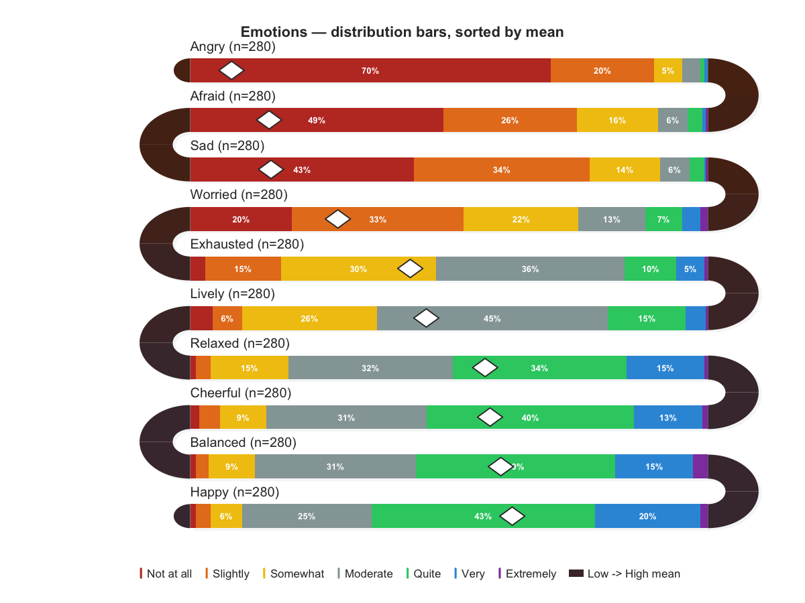

# snakeplot

Serpentine (snake) plots for survey responses, experience sampling (EMA/ESM)
data, and activity timelines using base R graphics. Zero external dependencies.

## Installation

```r
# From GitHub
devtools::install_github("mohsaqr/snakeplot")

# Once on CRAN
install.packages("snakeplot")
```

## Overview

Snake plots arrange data as horizontal bands in a serpentine layout — each
row reverses direction and connects to the next through a U-turn arc. The
package provides six functions:

| Function | Purpose |
|----------|---------|
| `survey_snake()` | Survey/EMA responses with ticks, bars, correlations, faceting |
| `activity_snake()` | Daily activity timelines with event blocks or rug ticks |
| `survey_sequence()` | Stacked 100% horizontal bars in serpentine layout |
| `sequential_dist()` | Sequential (monochrome) variant of `survey_sequence()` |
| `line_snake()` | Continuous intensity line plot (experimental) |
| `facet_snake()` | Generic multi-panel wrapper for any snake function |

## Bundled datasets

Three datasets from Neubauer & Schmiedek (2024) are included:

| Dataset | Rows | Description |
|---------|------|-------------|
| `ema_emotions` | 280 | Person-level means for 10 emotions (1-7 scale) |
| `student_survey` | 280 | 34 items across 4 constructs, prefixed for faceting |
| `ema_beeps` | 500 | Beep-level timestamps + anger/happiness ratings (14 days) |

## Examples

### `survey_snake()` — distribution bars

```r
library(snakeplot)

cols7 <- c("#C0392B", "#E67E22", "#F1C40F", "#95A5A6",
           "#2ECC71", "#3498DB", "#8E44AD")
labs7 <- c("1" = "Not at all", "2" = "Slightly", "3" = "Somewhat",
           "4" = "Moderate",   "5" = "Quite",    "6" = "Very",
           "7" = "Extremely")

survey_snake(ema_emotions, tick_shape = "bar", sort_by = "mean",
             colors = cols7, level_labels = labs7,
             label_cex = 1.0, legend_cex = 0.85,
             title = "Emotions — distribution bars, sorted by mean")
```



### `survey_snake()` — correlation arcs

```r
survey_snake(ema_emotions, tick_shape = "line",
             arc_fill = "correlation", sort_by = "mean",
             colors = cols7, level_labels = labs7,
             label_cex = 1.0, legend_cex = 0.85,
             title = "Emotions — correlations at U-turns")
```


### `survey_snake()` — daily EMA, ticks by time-of-day

```r
survey_snake(ema_beeps, var = "angry", day = "day",
             timestamp = "start_time",
             colors = cols7, arc_fill = "none",
             level_labels = labs7,
             label_cex = 1.0, legend_cex = 0.85,
             title = "Anger — 14 days, ticks by time-of-day")
```


### `survey_snake()` — daily EMA, distribution bars

```r
survey_snake(ema_beeps, var = "happy", day = "day",
             tick_shape = "bar",
             colors = cols7, arc_fill = "none",
             level_labels = labs7,
             label_cex = 1.0, legend_cex = 0.85,
             title = "Happiness — 14 days, distribution bars")
```


### `survey_snake()` — faceted multi-construct

```r
survey_snake(student_survey, facet = TRUE, facet_ncol = 2L,
             tick_shape = "bar", sort_by = "mean",
             colors = cols7, level_labels = labs7,
             label_cex = 1.0, legend_cex = 0.85)
```


### `activity_snake()` — rug ticks

```r
set.seed(42)
days <- c("Mon", "Tue", "Wed", "Thu", "Fri", "Sat", "Sun")
d <- data.frame(
  day      = rep(days, each = 40),
  start    = round(runif(280, 360, 1400)),
  duration = 0
)
activity_snake(d)
```


### `activity_snake()` — duration blocks

```r
d2 <- data.frame(
  day      = rep(days, each = 8),
  start    = round(runif(56, 360, 1200)),
  duration = round(runif(56, 15, 120))
)
activity_snake(d2, event_color = "#e09480", band_color = "#3d2518")
```


### `survey_sequence()` — stacked bars

```r
set.seed(1)
counts <- matrix(sample(20:80, 25, replace = TRUE), nrow = 5)
survey_sequence(counts, paste0("Item ", 1:5), as.character(1:5))
```


## Key parameters for `survey_snake()`

| Parameter | Description |
|-----------|-------------|
| `tick_shape` | `"line"` (default), `"dot"`, or `"bar"` (stacked proportional) |
| `sort_by` | `"none"`, `"mean"`, or `"net"` |
| `arc_fill` | `"none"` (two-tone), `"correlation"`, `"mean_prev"`, `"blend"` |
| `colors` | Custom color palette for response levels |
| `level_labels` | Named vector mapping levels to display labels |
| `facet` | `TRUE` (auto-group by prefix) or named list of column groups |
| `facet_ncol` | Number of columns in facet grid |
| `var`, `day`, `timestamp` | Auto-pivot EMA data into daily bands |
| `label_cex`, `legend_cex` | Text size scaling |
| `show_mean`, `show_median` | Toggle diamond/dashed-line markers |

## Data source

The bundled datasets are derived from:

Neubauer, A. B., & Schmiedek, F. (2024). Approaching academic adjustment
on multiple time scales. *Zeitschrift fuer Erziehungswissenschaft*, *27*(1),
147-168. https://doi.org/10.1007/s11618-023-01182-8

- [Original data](https://osf.io/bhq3p)
- [Codebook](https://osf.io/csfwg)
- [Code](https://osf.io/84kdr/files)
- License: CC-BY 4.0

## License

MIT
