# snakeplot

[](https://opensource.org/licenses/MIT)
[](https://github.com/mohsaqr/snakeplot/actions/workflows/R-CMD-check.yaml)
[](https://codecov.io/gh/mohsaqr/snakeplot)
[](https://github.com/mohsaqr/snakeplot)
[]()

Serpentine (snake) plots for survey responses, experience sampling (EMA/ESM)
data, and activity timelines using base R graphics. Zero external dependencies.

## Installation

```r
# From GitHub
devtools::install_github("mohsaqr/snakeplot")

# Once on CRAN
install.packages("snakeplot")
```

## Overview

Snake plots arrange data as horizontal bands in a serpentine layout — each
row reverses direction and connects to the next through a U-turn arc. The
package provides six plotting functions and 10 built-in color palettes:

| Function | Purpose |
|----------|---------|
| `survey_snake()` | Survey/EMA responses with ticks, bars, correlations, faceting |
| `activity_snake()` | Daily activity timelines with event blocks or rug ticks |
| `sequence_snake()` | State sequence as colored blocks flowing through serpentine layout |
| `timeline_snake()` | Career/life-event timeline from a 3-column data.frame (role, start, end) |
| `survey_sequence()` | Stacked 100% horizontal bars in serpentine layout |
| `sequential_dist()` | Sequential (monochrome) variant of `survey_sequence()` |
| `line_snake()` | Continuous intensity line plot (experimental) |
| `facet_snake()` | Generic multi-panel wrapper for any snake function |

## Bundled datasets

Three datasets from Neubauer & Schmiedek (2024) are included:

| Dataset | Rows | Description |
|---------|------|-------------|
| `ema_emotions` | 280 | Person-level means for 10 emotions (1-7 scale) |
| `student_survey` | 280 | 34 items across 4 constructs, prefixed for faceting |
| `ema_beeps` | 11 474 | Beep-level timestamps + anger/happiness ratings (14 days) |

## Examples

```r
library(snakeplot)

labs7 <- c("1" = "Not at all", "2" = "Slightly", "3" = "Somewhat",
           "4" = "Moderate",   "5" = "Quite",    "6" = "Very",
           "7" = "Extremely")
```

### `survey_snake()` — daily value distribution ticks

```r
survey_snake(ema_beeps, var = "angry", day = "day",
             colors = snake_palettes$ocean, level_labels = labs7,
             title = "Anger — 14 days, value distribution")
```

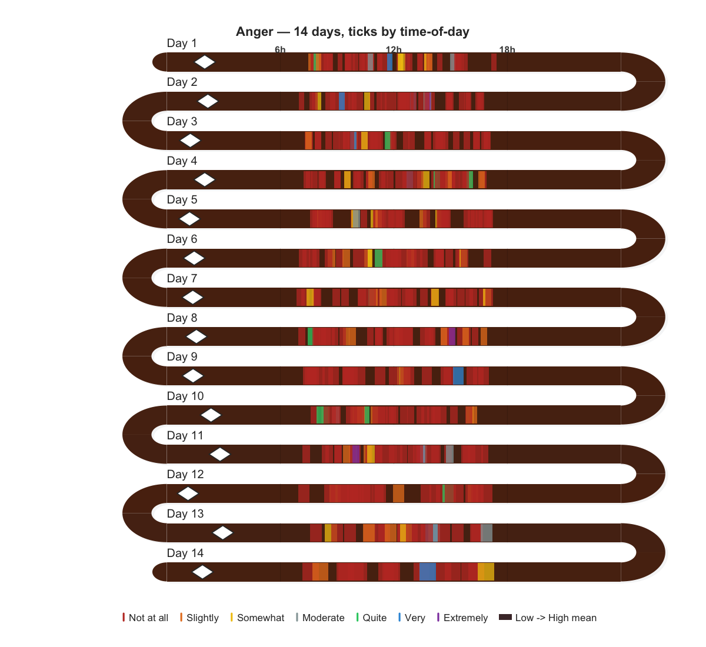

### `survey_snake()` — correlation arcs

```r
survey_snake(ema_emotions, tick_shape = "line",
             arc_fill = "correlation", sort_by = "mean",
             colors = snake_palettes$ocean, level_labels = labs7,
             title = "Emotions — correlations at U-turns")
```

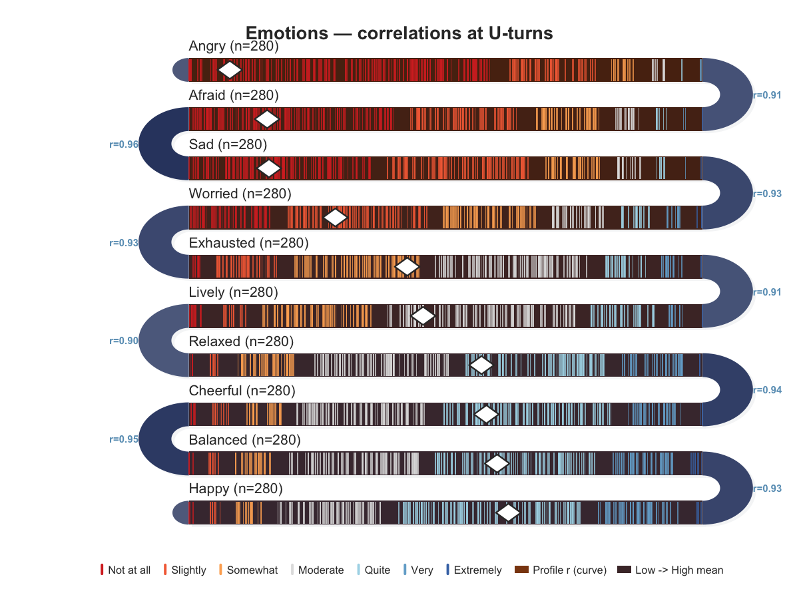

### `survey_snake()` — dot plot with dark bands

```r
survey_snake(ema_emotions, tick_shape = "dot", sort_by = "mean",
             colors = snake_palettes$ocean, level_labels = labs7,
             band_palette = c("#1a1228", "#1a2a42"),
             title = "Emotions — dots on dark bands")
```

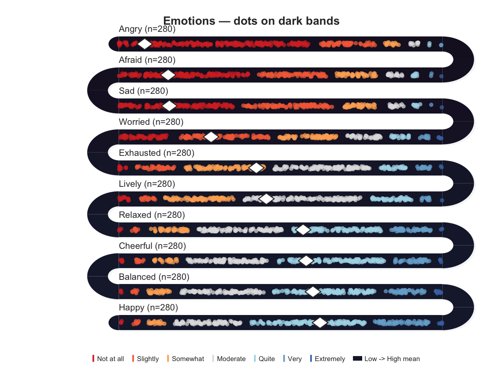

### `survey_snake()` — faceted multi-construct

```r
survey_snake(student_survey, facet = TRUE, facet_ncol = 2L,
             tick_shape = "bar", sort_by = "mean",
             colors = snake_palettes$ocean, level_labels = labs7)
```

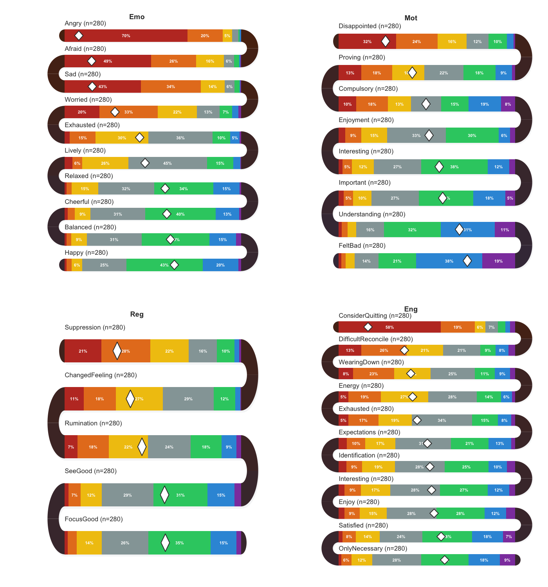

### `survey_snake()` — daily distribution bars

```r
survey_snake(ema_beeps, var = "happy", day = "day",
             tick_shape = "bar", bar_reverse = TRUE,
             colors = snake_palettes$ocean, level_labels = labs7,
             title = "Happiness — 14 days, distribution bars")
```

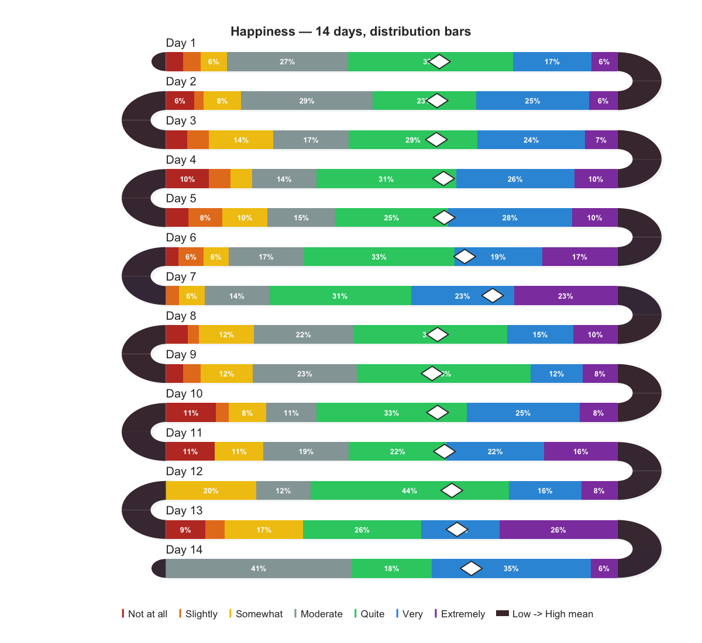

### `activity_snake()` — rug ticks

```r
set.seed(42)
days <- c("Mon", "Tue", "Wed", "Thu", "Fri", "Sat", "Sun")
d <- data.frame(
  day      = rep(days, each = 40),
  start    = round(runif(280, 360, 1400)),
  duration = 0
)
activity_snake(d)
```

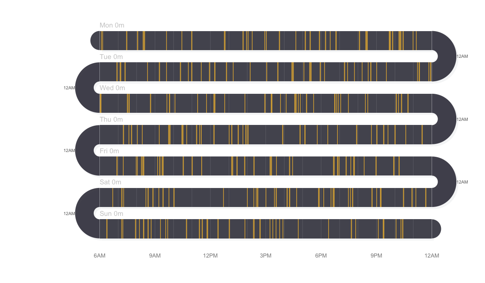

### `activity_snake()` — duration blocks

```r
d2 <- data.frame(
  day      = rep(days, each = 8),
  start    = round(runif(56, 360, 1200)),
  duration = round(runif(56, 15, 120))
)
activity_snake(d2, event_color = "#e09480", band_color = "#3d2518")
```

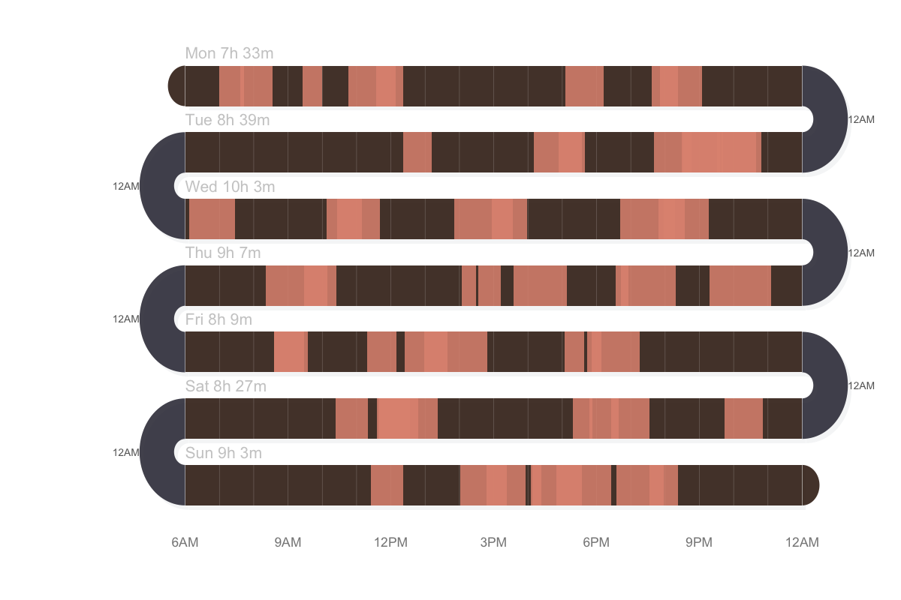

### `sequence_snake()` — state sequence

```r
set.seed(42)
verbs <- c("Read", "Write", "Discuss", "Listen",
           "Search", "Plan", "Code", "Review")
seq75 <- character(0)
while (length(seq75) < 75) {
  seq75 <- c(seq75, rep(sample(verbs, 1), sample(1:4, 1)))
}
seq75 <- seq75[seq_len(75)]
sequence_snake(seq75, title = "75-step learning sequence")
```

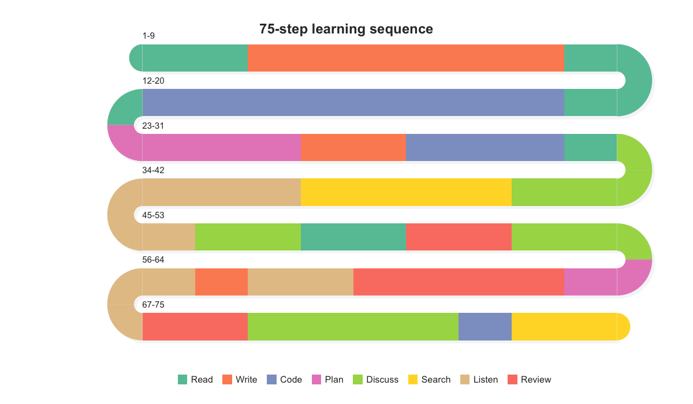

### `timeline_snake()` — career/event timeline

```r
career <- data.frame(
  role  = c("Intern", "Junior Dev", "Mid Dev",
            "Senior Dev", "Tech Lead", "Architect"),
  start = c("2015-01", "2015-07", "2017-01",
            "2019-07", "2022-07", "2024-01"),
  end   = c("2015-06", "2016-12", "2019-06",
            "2022-06", "2023-12", "2024-12")
)
timeline_snake(career,
               title = "Software Engineer — Career Path (2015-2024)")
```

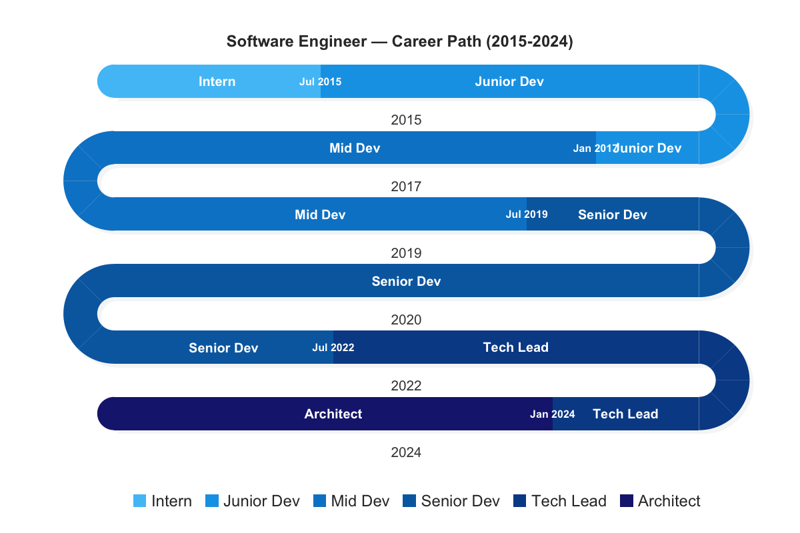

### `survey_sequence()` — stacked bars

```r
survey_sequence(ema_emotions, colors = snake_palettes$ocean)
```

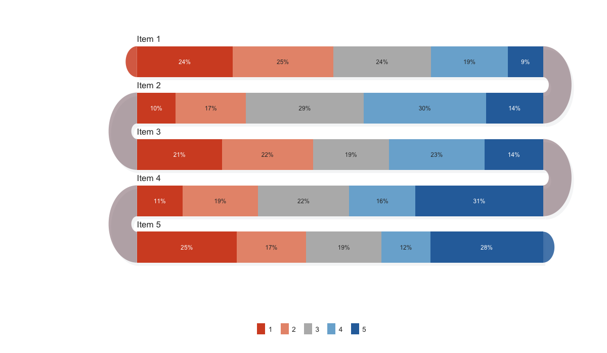

### `line_snake()` — continuous intensity

```r
set.seed(42)
hours <- seq(0, 1440, by = 10)
d_line <- data.frame(
  day   = rep(c("Mon", "Tue", "Wed", "Thu", "Fri"), each = length(hours)),
  time  = rep(hours, 5),
  value = sin(rep(hours, 5) / 1440 * 4 * pi) * 50 + 50 +
          rnorm(5 * length(hours), 0, 8)
)
line_snake(d_line, fill_color = "#e74c3c")
```

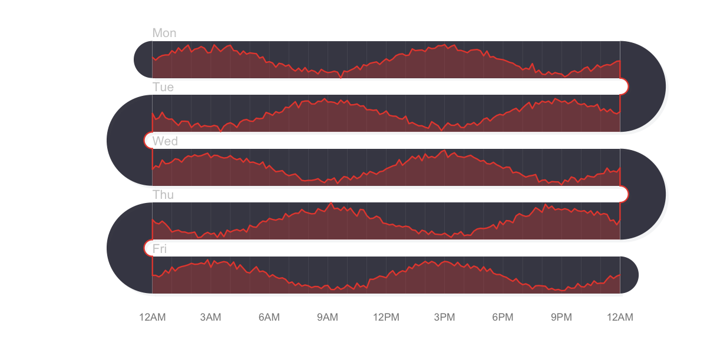

## Built-in palettes

10 palettes ship with the package — 5 diverging, 5 sequential:

```r
names(snake_palettes)
#> "classic" "earth" "ocean" "sunset" "berry" "blues" "greens" "grays" "warm" "viridis"

# Use directly
survey_snake(ema_emotions, colors = snake_palettes$earth, tick_shape = "bar")

# Interpolate to any length
snake_palette("sunset", n = 5)
```

## Key parameters for `survey_snake()`

| Parameter | Description |
|-----------|-------------|
| `tick_shape` | `"line"` (default), `"dot"`, or `"bar"` (stacked proportional) |
| `sort_by` | `"none"`, `"mean"`, or `"net"` |
| `arc_fill` | `"none"` (two-tone), `"correlation"`, `"mean_prev"`, `"blend"` |
| `colors` | Custom color palette or `snake_palettes$name` |
| `band_palette` | 2+ anchor colors for band shading (default: brown-to-slate) |
| `bar_reverse` | `TRUE` to draw bars from highest level first |
| `level_labels` | Named vector mapping levels to display labels |
| `facet` | `TRUE` (auto-group by prefix) or named list of column groups |
| `var`, `day`, `timestamp` | Auto-pivot EMA data into daily bands |
| `show_mean`, `show_median` | Toggle diamond/dashed-line markers |

## Data source

The bundled datasets are derived from:

Neubauer, A. B., & Schmiedek, F. (2024). Approaching academic adjustment
on multiple time scales. *Zeitschrift fuer Erziehungswissenschaft*, *27*(1),
147-168. https://doi.org/10.1007/s11618-023-01182-8

- [Original data](https://osf.io/bhq3p)
- [Codebook](https://osf.io/csfwg)
- [Code](https://osf.io/84kdr/files)
- License: CC-BY 4.0

## License

MIT
