# Snake Plots

Snake plots display data as horizontal bands in a serpentine layout —
each row reverses direction and connects to the next through a U-turn
arc. This compact layout lets you compare many items at once while
preserving adjacency information such as inter-item correlations.

The package ships with three datasets from an experience sampling study
of university students (Neubauer & Schmiedek, 2024), rescaled to a 1–5
Likert scale, and 10 built-in color palettes via `snake_palettes`:

``` r
library(snakeplot)

labs5 <- c("1" = "Not at all", "2" = "Slightly", "3" = "Moderate",
           "4" = "Quite",      "5" = "Extremely")
```

## Daily EMA — value distribution ticks

When you have beep-level data, `var` and `day` auto-pivot into one band
per day. Ticks are positioned within proportional zones by response
level:

``` r
survey_snake(ema_beeps, var = "angry", day = "day",
             colors = snake_palettes$sunset, level_labels = labs5,
             title = "Anger — 14 days, value distribution")
```

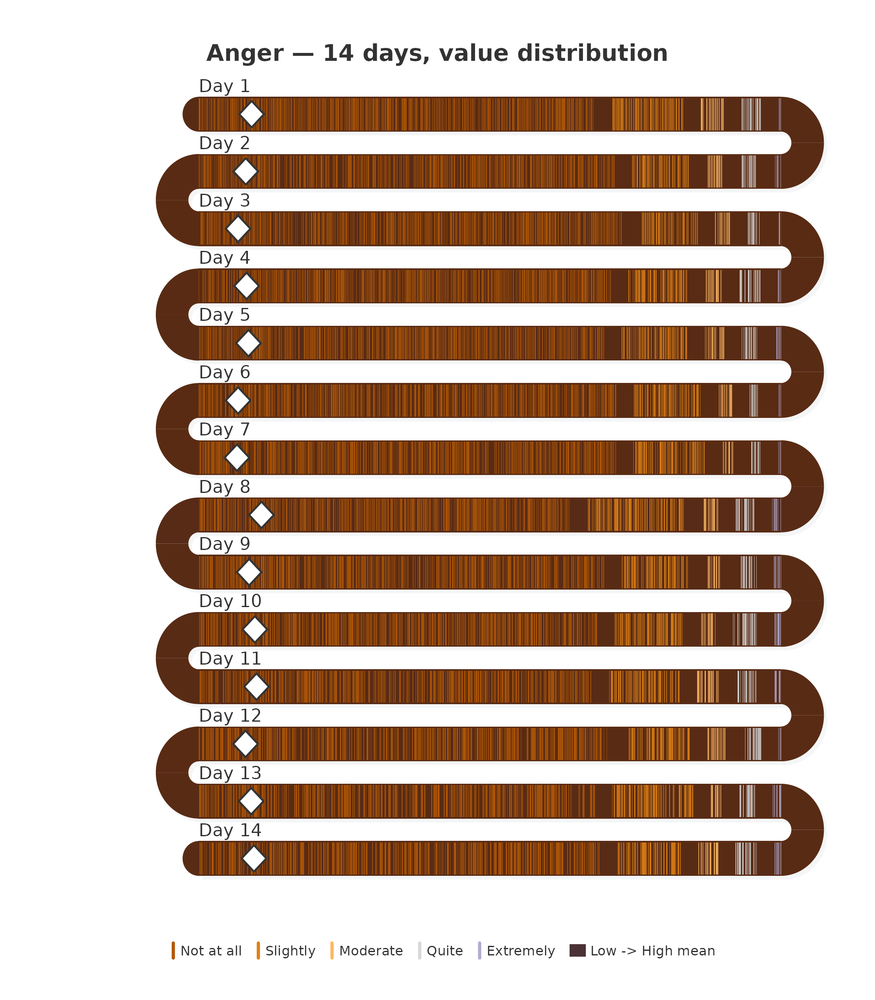

## Daily EMA — distribution bars

The same daily data with `tick_shape = "bar"` shows how response
distributions shift across days. Use `bar_reverse = TRUE` to start from
the highest level:

``` r
survey_snake(ema_beeps, var = "happy", day = "day",
             tick_shape = "bar", bar_reverse = TRUE,
             colors = snake_palettes$sunset, level_labels = labs5,
             title = "Happiness — 14 days, distribution bars")
```

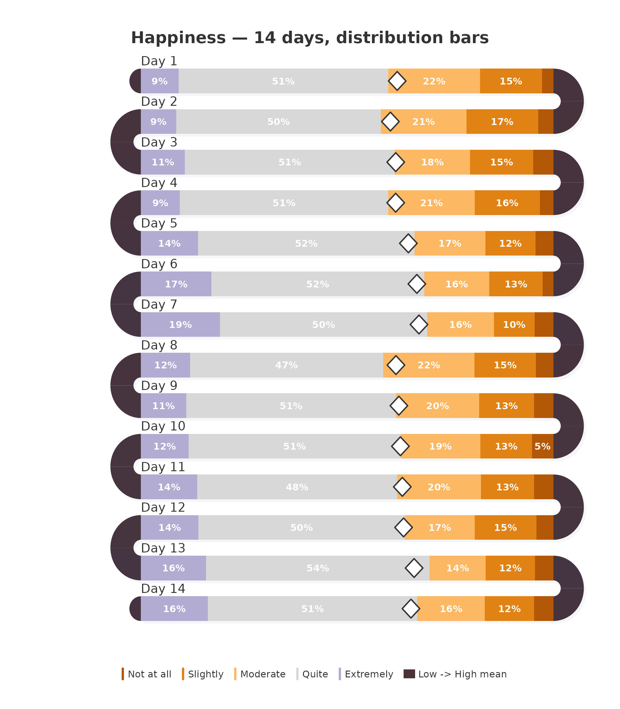

## Activity timelines

[`activity_snake()`](https://saqr.me/Snakeplot/reference/activity_snake.md)
shows daily event timelines — rug ticks or duration blocks on a dark
ribbon:

``` r
set.seed(42)
days <- c("Mon", "Tue", "Wed", "Thu", "Fri", "Sat", "Sun")
d <- data.frame(
  day      = rep(days, each = 40),
  start    = round(runif(280, 360, 1400)),
  duration = 0
)
activity_snake(d)
```

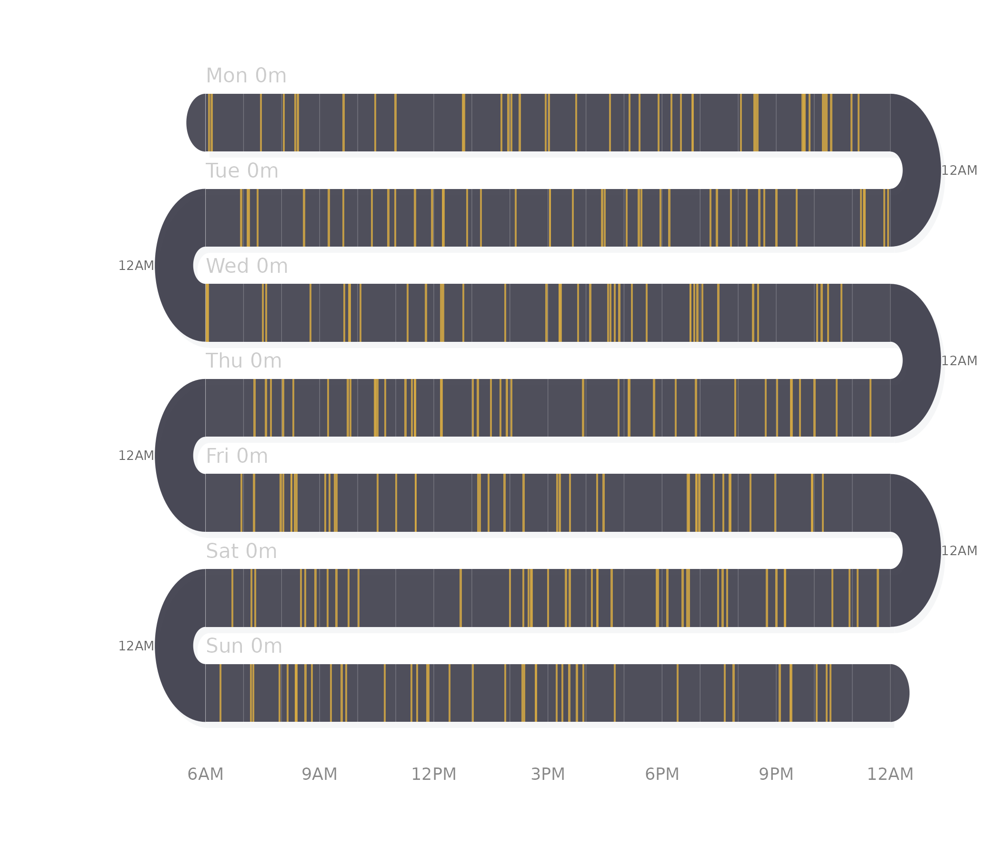

Pass character timestamps directly — they are parsed automatically:

``` r
set.seed(42)
dates <- seq(as.POSIXct("2024-03-11"), as.POSIXct("2024-03-17"),
             by = "day")
events <- data.frame(
  timestamp = format(
    rep(dates, each = 30) + round(runif(210, 6*3600, 22*3600)),
    "%Y-%m-%d %H:%M:%S"
  ),
  stringsAsFactors = FALSE
)
activity_snake(events, title = "From character timestamps — 7 days")
```

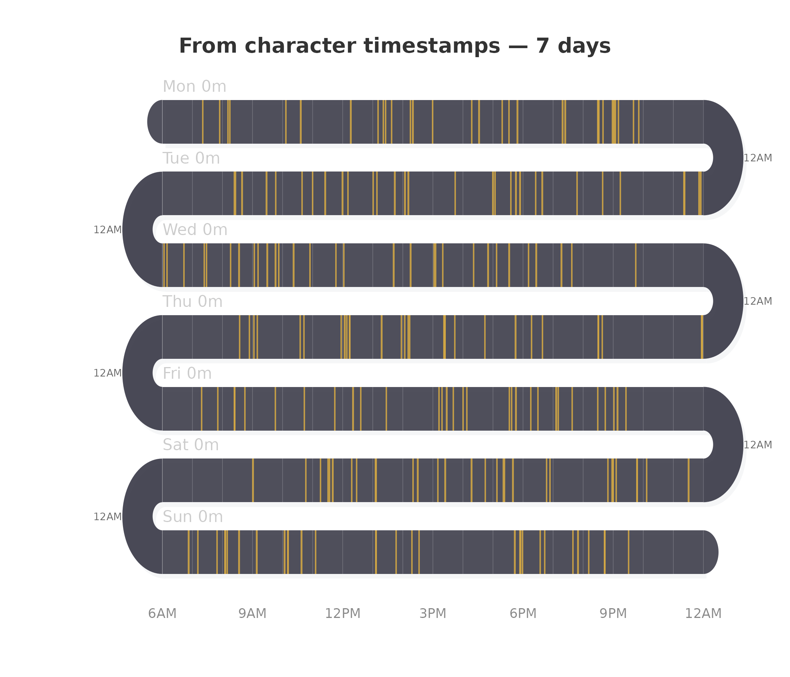

Duration blocks show event length as filled rectangles:

``` r
set.seed(42)
days <- c("Mon", "Tue", "Wed", "Thu", "Fri", "Sat", "Sun")
d2 <- data.frame(
  day      = rep(days, each = 8),
  start    = round(runif(56, 360, 1200)),
  duration = round(runif(56, 15, 120))
)
activity_snake(d2, event_color = "#e09480", band_color = "#3d2518",
               title = "Weekly activity — duration blocks")
```

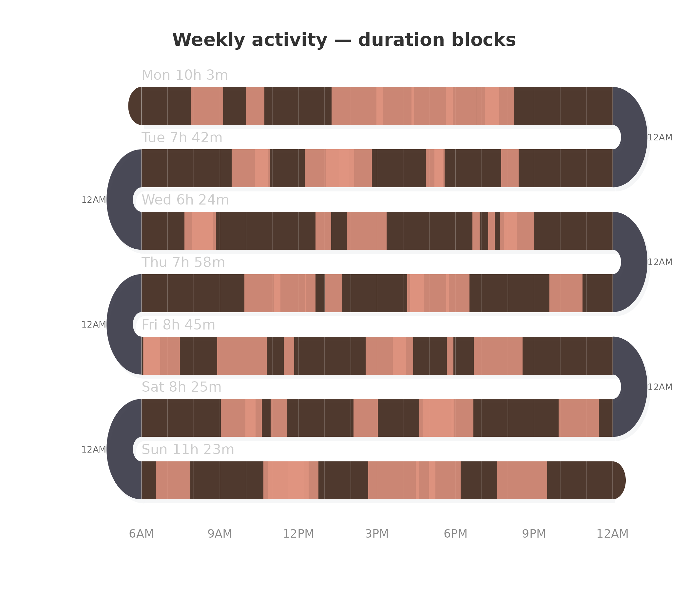

With `flow = "natural"`, all bands read 6AM→12AM left-to-right — no
alternating. Compare: the default boustrophedon flips morning events
between left and right on alternate rows, while natural keeps them
consistently on the left:

``` r
set.seed(1)
d_morning <- data.frame(
  day      = rep(days, each = 15),
  start    = round(runif(105, 360, 720)),
  duration = 0
)
activity_snake(d_morning, flow = "natural",
               title = "Morning events — flow='natural' (6AM always left)")
```

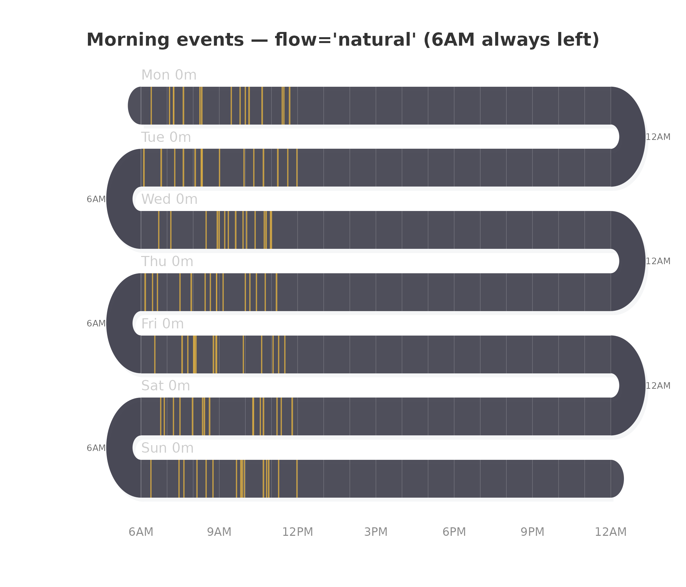

## Line snake

[`line_snake()`](https://saqr.me/Snakeplot/reference/line_snake.md)
draws a continuous intensity line winding through bands:

``` r
set.seed(42)
hours <- seq(0, 1440, by = 10)
d_line <- data.frame(
  day   = rep(c("Mon", "Tue", "Wed", "Thu", "Fri"), each = length(hours)),
  time  = rep(hours, 5),
  value = sin(rep(hours, 5) / 1440 * 4 * pi) * 50 + 50 +
          rnorm(5 * length(hours), 0, 8)
)
line_snake(d_line, fill_color = "#e74c3c")
```

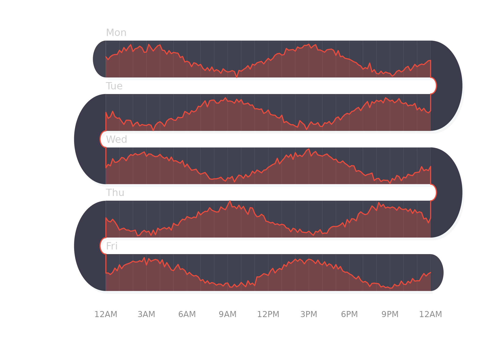

## Timeline snake

[`timeline_snake()`](https://saqr.me/Snakeplot/reference/timeline_snake.md)
takes a 3-column data.frame (role, start, end) and auto-generates
monthly blocks, transition labels, and band year labels:

``` r
career <- data.frame(
  role  = c("Intern", "Junior Dev", "Mid Dev",
            "Senior Dev", "Tech Lead", "Architect"),
  start = c("2015-01", "2015-07", "2017-01",
            "2019-07", "2022-07", "2024-01"),
  end   = c("2015-06", "2016-12", "2019-06",
            "2022-06", "2023-12", "2024-12")
)
timeline_snake(career,
               title = "Software Engineer — Career Path (2015-2024)")
```


## Tick lines with correlation arcs

Individual responses as colored tick marks, with inter-item Pearson *r*
displayed at each U-turn arc:

``` r
survey_snake(ema_emotions, tick_shape = "line",
             arc_fill = "correlation", sort_by = "mean",
             colors = snake_palettes$berry, level_labels = labs5,
             title = "Emotions — correlations at U-turns")
```

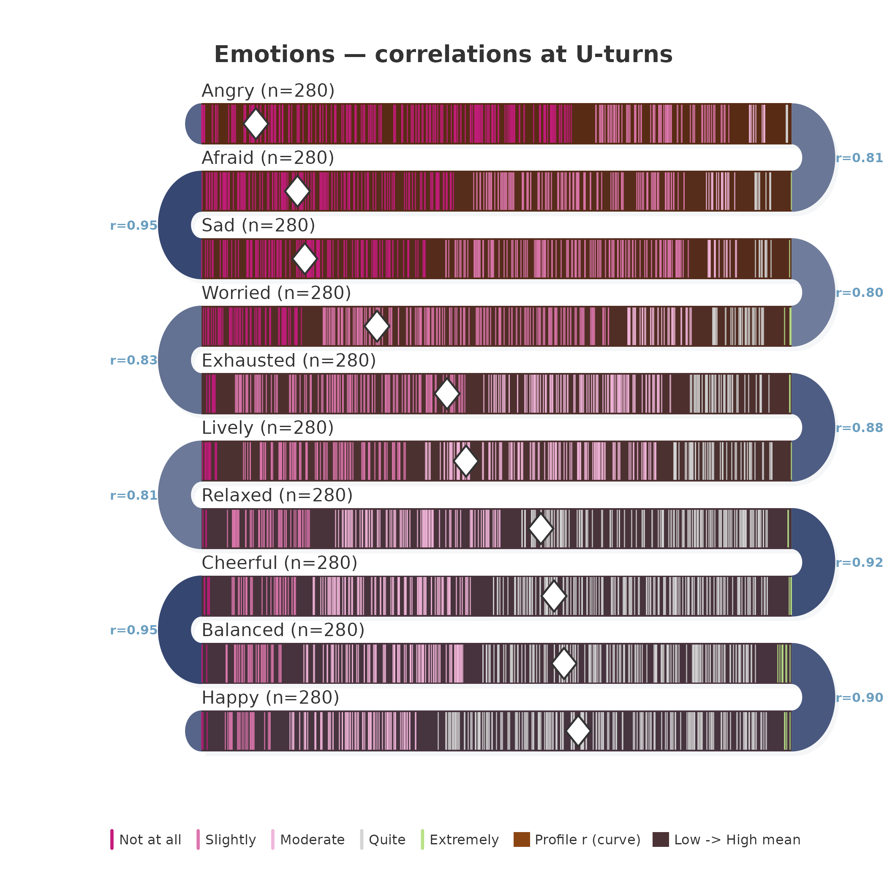

## Dot plot with dark bands

Use `band_palette` for darker band shading. Dots with jitter show
individual responses:

``` r
survey_snake(ema_emotions, tick_shape = "dot", sort_by = "mean",
             colors = snake_palettes$viridis, level_labels = labs5,
             band_palette = c("#1a1228", "#1a2a42"),
             title = "Emotions — dots on dark bands")
```

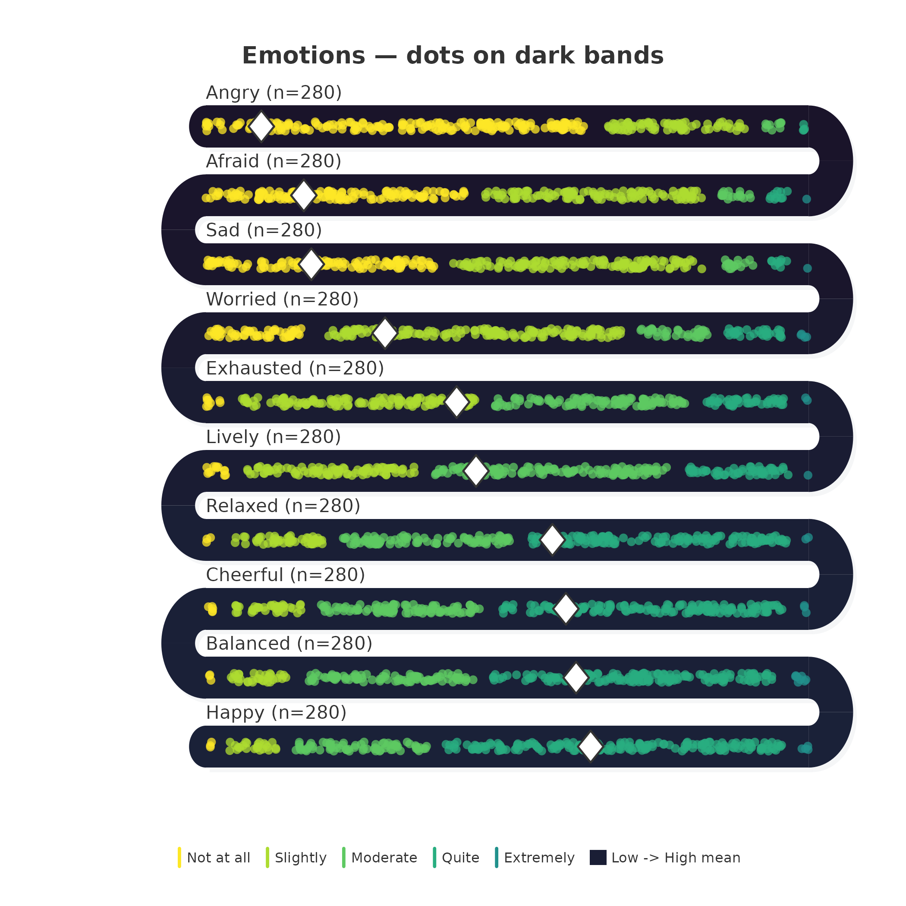

## Mean and median markers

A diamond shows the item mean; a dashed line shows the median:

``` r
survey_snake(ema_emotions, tick_shape = "bar", sort_by = "mean",
             show_mean = TRUE, show_median = TRUE,
             colors = snake_palettes$sunset, level_labels = labs5,
             title = "Emotions — mean (diamond) and median (dashed)")
```

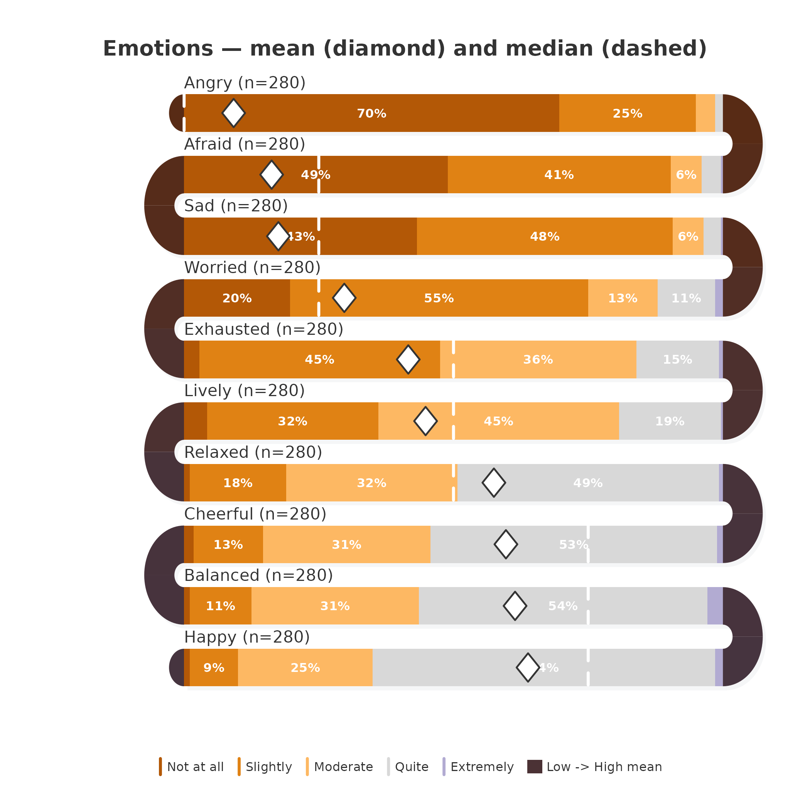

## Faceted multi-construct

When column names share a prefix (e.g., `Emo_`, `Mot_`), `facet = TRUE`
auto-groups them into panels. Prefixes are stripped from labels:

``` r
survey_snake(student_survey, facet = TRUE, facet_ncol = 2L,
             tick_shape = "bar", sort_by = "mean",
             colors = snake_palettes$earth, level_labels = labs5)
```

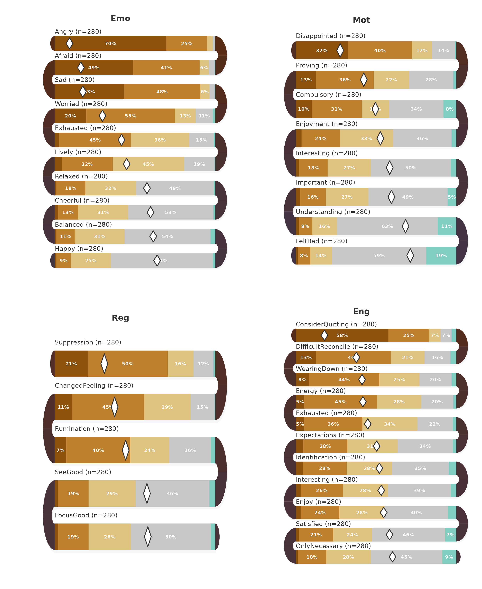

## Survey sequence

[`survey_sequence()`](https://saqr.me/Snakeplot/reference/survey_sequence.md)
renders 100% stacked horizontal bars in a serpentine layout:

``` r
survey_sequence(ema_emotions, colors = snake_palettes$earth)
```

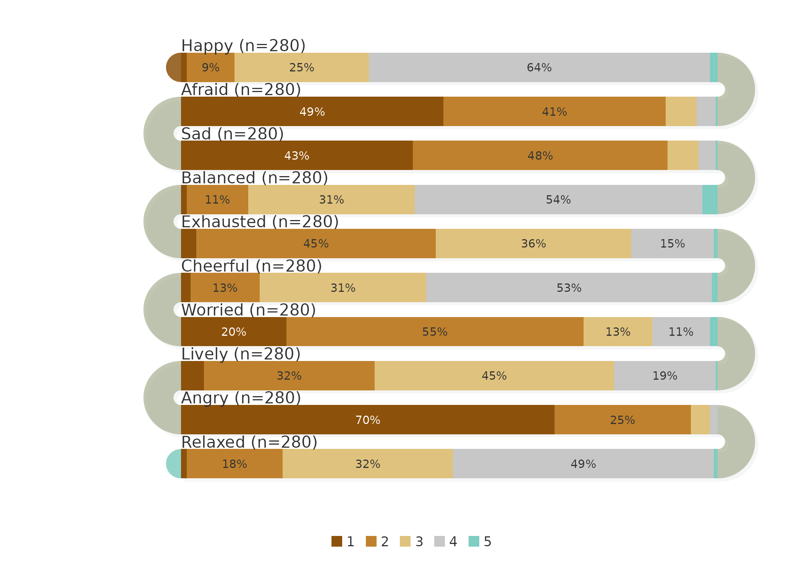

Matrix with row/col names — labels and levels are inferred
automatically:

``` r
m <- matrix(c(50, 120, 80, 30,
              40,  90, 110, 60,
              70, 100,  70, 50,
              80,  85,  95, 40,
              30, 110,  90, 70,
              60,  75, 105, 55,
              45, 130,  65, 35), nrow = 7, byrow = TRUE)
rownames(m) <- c("Satisfaction", "Engagement", "Motivation",
                  "Belonging", "Autonomy", "Competence", "Wellbeing")
colnames(m) <- c("Low", "Medium", "High", "Very High")
survey_sequence(m, title = "Labels from matrix dimnames",
                colors = snake_palettes$sunset)
```

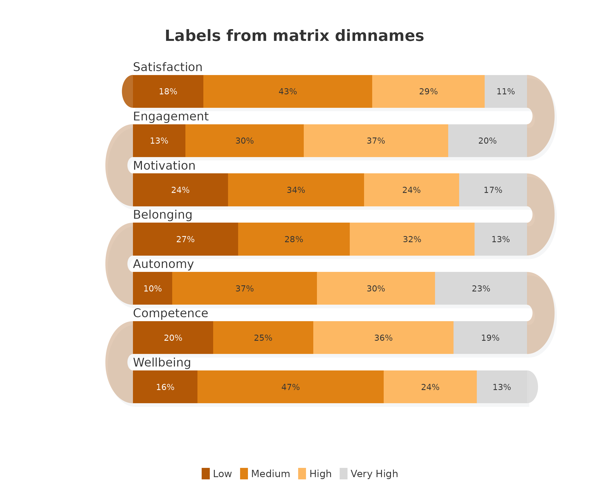

## Sequential distribution

[`sequential_dist()`](https://saqr.me/Snakeplot/reference/sequential_dist.md)
is a monochrome variant of
[`survey_sequence()`](https://saqr.me/Snakeplot/reference/survey_sequence.md):

``` r
sequential_dist(ema_emotions)
```

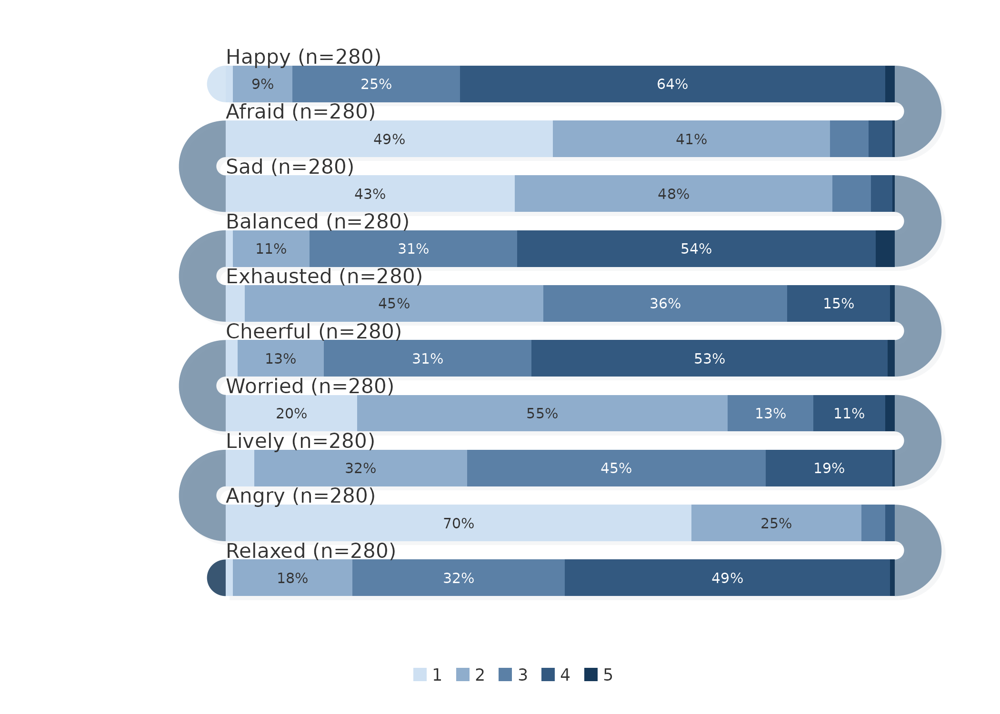

## Sequence snake

[`sequence_snake()`](https://saqr.me/Snakeplot/reference/sequence_snake.md)
displays a state sequence as colored blocks flowing through the
serpentine layout — each block is one time point colored by its state:

``` r
set.seed(42)
verbs <- c("Read", "Write", "Discuss", "Listen",
           "Search", "Plan", "Code", "Review")
seq75 <- character(0)
while (length(seq75) < 75) {
  seq75 <- c(seq75, rep(sample(verbs, 1), sample(1:4, 1)))
}
seq75 <- seq75[seq_len(75)]
sequence_snake(seq75, title = "75-step learning sequence")
```

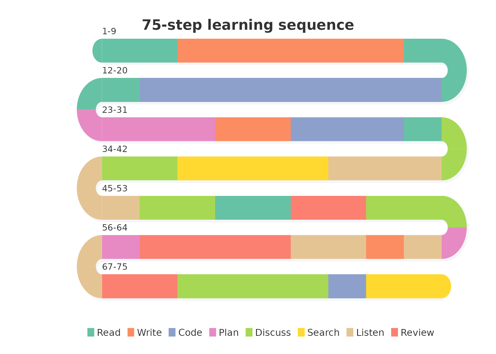

Pass a data.frame directly — the first character/factor column is
auto-detected:

``` r
set.seed(1)
logs <- data.frame(
  id     = 1:80,
  action = sample(c("Read", "Write", "Discuss", "Search", "Code",
                     "Plan", "Review", "Listen"), 80, replace = TRUE)
)
sequence_snake(logs, rows = 5,
               title = "From a data.frame — column auto-detected")
#> Using column 'action' as sequence
```

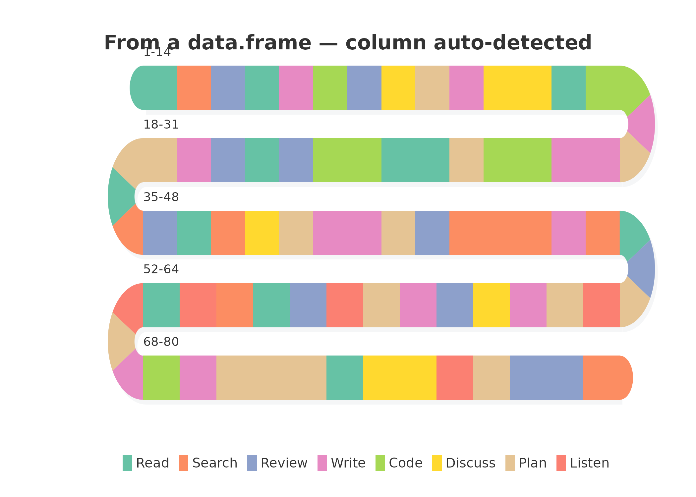

## Built-in palettes

10 palettes are available via `snake_palettes` or
[`snake_palette()`](https://saqr.me/Snakeplot/reference/snake_palette.md):

``` r
names(snake_palettes)
#>  [1] "classic" "earth"   "ocean"   "sunset"  "berry"   "blues"   "greens" 
#>  [8] "grays"   "warm"    "viridis"
```

Use any palette by name:

``` r
survey_snake(ema_emotions, colors = snake_palettes$earth, tick_shape = "bar")
snake_palette("sunset", n = 5)  # interpolate to 5 colors
```
